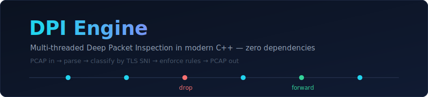
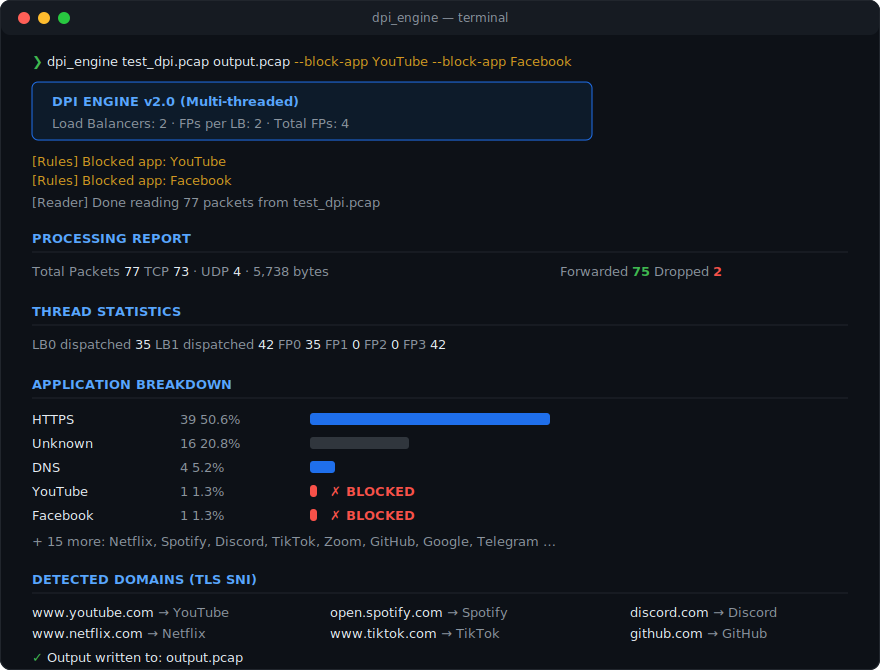
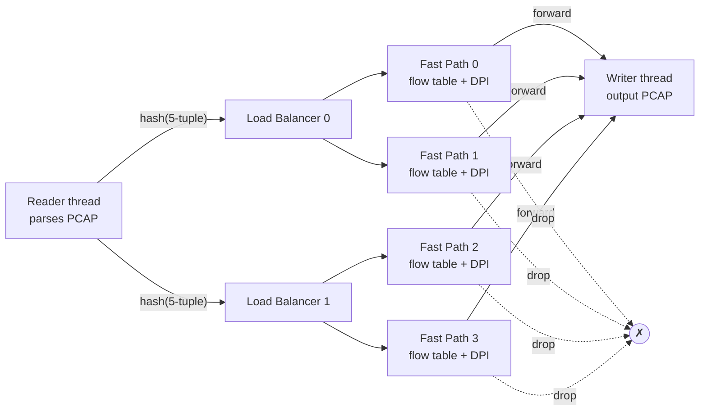

<div align="center">



**A multi-threaded Deep Packet Inspection engine written from scratch in modern C++.**
No libpcap. No Boost. No external dependencies — every byte of the PCAP format, Ethernet/IP/TCP/UDP headers, and the TLS handshake is parsed by hand.


</div>

---

## What it does

Feed it a Wireshark capture and it identifies **which applications the traffic belongs to** — YouTube, Netflix, Discord, TikTok, and 15+ others — *even though the traffic is encrypted with HTTPS*. It can then drop packets by app, domain, or source IP, and write the filtered traffic back out as a valid PCAP.



The trick: when a browser starts a TLS connection, the very first packet (the **Client Hello**) carries the destination hostname in plaintext — the **SNI** (Server Name Indication) field. The engine walks the raw TLS handshake bytes, pulls out `www.youtube.com`, and classifies the whole connection from that single packet. This is the same technique real ISPs and enterprise firewalls use.

## Highlights

- **Hand-written protocol parsers** — PCAP file format, Ethernet, IPv4, TCP, UDP, TLS Client Hello, and HTTP `Host:` headers, all parsed directly from raw bytes with proper bounds checking and endianness handling.
- **Multi-threaded pipeline** — a reader thread, load-balancer threads, and parallel fast-path worker threads connected by hand-rolled thread-safe queues (`std::mutex` + `std::condition_variable`, bounded, with backpressure).
- **Consistent flow hashing** — every packet of a connection hashes to the *same* worker thread, so per-flow state (SNI, verdict) needs no cross-thread locking.
- **Flow-based blocking** — once a connection's Client Hello reveals a blocked app, every subsequent packet of that 5-tuple is dropped, not just the one that matched.
- **Real traffic report** — per-app breakdown with percentages, per-thread work distribution, forwarded/dropped counts, and every detected domain.
- **Test data generator included** — a Python script synthesizes a PCAP with realistic TLS handshakes, HTTP requests, and DNS queries for 18 well-known services, so the whole project is runnable with zero setup.

## Architecture



Every stage is connected by a bounded thread-safe queue. The two-level `hash(5-tuple)` routing guarantees that all packets of one TCP connection land on the same fast-path thread — that thread owns the flow's state exclusively, so classification and blocking need **no locks on the hot path**. Thread counts are configurable (`--lbs`, `--fps`).

### How a packet is judged

```
SYN            → no SNI yet         → forward
SYN-ACK, ACK   → no SNI yet         → forward
Client Hello   → SNI: www.youtube.com → app = YouTube → rule hit → mark flow BLOCKED, drop
every packet after → flow is BLOCKED → drop
```

Rules are checked in order: source-IP blacklist → app blacklist → domain substring match. Short SNI patterns use exact-label matching to avoid substring false positives (e.g. `x.com` must not match `netflix.com`).

## Quick start

```bash
# 1. Generate a synthetic test capture (77 packets, 18 services)
python generate_test_pcap.py

# 2. Build — plain g++, no libraries needed
g++ -std=c++17 -O2 -I include -o dpi_engine \
    src/dpi_mt.cpp src/pcap_reader.cpp src/packet_parser.cpp \
    src/sni_extractor.cpp src/types.cpp

# 3. Analyze a capture
./dpi_engine test_dpi.pcap output.pcap

# 4. Analyze and block
./dpi_engine test_dpi.pcap output.pcap --block-app YouTube --block-app Facebook
```

Works with real Wireshark captures too — anything saved as classic `.pcap` (Ethernet link type).

### CLI reference

| Flag | Effect |
|------|--------|
| `--block-app <name>` | Block an application (`YouTube`, `Netflix`, `TikTok`, …) |
| `--block-domain <str>` | Block any SNI containing this substring |
| `--block-ip <ip>` | Block all traffic from a source IP |
| `--lbs <n>` | Load-balancer threads (default 2) |
| `--fps <n>` | Fast-path threads per load balancer (default 2) |

## Project structure

```
├── include/
│   ├── thread_safe_queue.h   # Bounded MPMC queue (mutex + condvars)
│   ├── load_balancer.h       # LB stage: consistent-hash dispatch
│   ├── fast_path.h           # Worker stage: flow table, DPI, verdict
│   ├── sni_extractor.h       # TLS Client Hello / HTTP Host parsing
│   ├── packet_parser.h       # Ethernet / IPv4 / TCP / UDP
│   ├── pcap_reader.h         # PCAP file format
│   └── types.h               # FiveTuple, Flow, AppType, rules
├── src/
│   ├── dpi_mt.cpp            # ★ Multi-threaded engine (main)
│   ├── main_working.cpp      # Single-threaded reference version
│   └── ...                   # Implementations
└── generate_test_pcap.py     # Synthetic capture generator
```

A single-threaded version (`src/main_working.cpp`) implements the identical pipeline in one loop — useful for reading the logic without the concurrency machinery.

## Technical notes

<details>
<summary><b>Parsing the TLS Client Hello by hand</b></summary>

The extractor validates the record header (`0x16` = handshake, `0x01` = Client Hello), then walks the variable-length fields — 32-byte random, session ID, cipher suites, compression methods — to reach the extensions block, and scans it for extension type `0x0000` (server_name). Every offset is bounds-checked against the payload length before dereferencing, since captures can contain truncated packets.

```
TLS Record ─ Handshake ─ Client Hello
                          ├─ random / session / ciphers / compression  (skipped)
                          └─ Extensions
                              └─ type 0x0000 → "www.youtube.com"  ← extracted
```
</details>

<details>
<summary><b>Why consistent hashing instead of a shared flow table</b></summary>

A single shared `unordered_map<FiveTuple, Flow>` would need a lock (or sharded locks) on every packet. Instead, the same FNV-style hash routes at both stages, so a flow's packets serialize naturally onto one thread. Each fast path owns a private flow table — zero contention, cache-friendly, and it scales by adding threads.
</details>

<details>
<summary><b>PCAP I/O without libpcap</b></summary>

The reader validates the 24-byte global header (magic `0xa1b2c3d4`, Ethernet link type) and streams 16-byte per-packet headers + payloads; the writer emits the same format, so the filtered output opens directly in Wireshark.
</details>

## Possible extensions

QUIC/HTTP-3 initial-packet SNI, live capture via raw sockets/Npcap, rate limiting instead of hard drops, and a rules file. The classifier is one function — adding an app signature is a two-line change in `src/types.cpp`.

---

<div align="center">
<sub>Built as a from-scratch systems programming project — protocol parsing, lock-free-ish concurrency design, and network security in one codebase.</sub>
</div>
